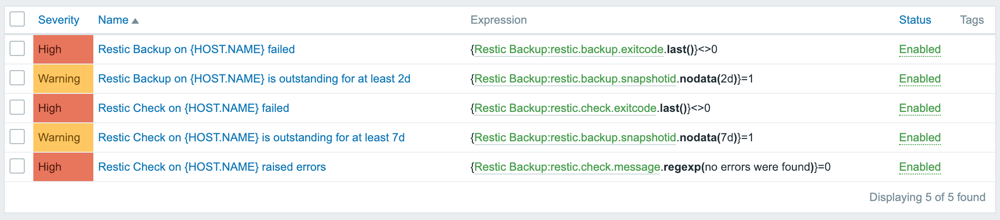

# Zabbix Template: Restic Backup

This script logs [restic backup](https://restic.net/) tasks to Zabbix.

## Screenshots
### Latest Data


### Triggers


## Requirements
* Restic
* Zabbix-Sender
* python3
* python3-pip
* python3: humanfriendly

## How to Use

### Example: Backup
```bash
#!/bin/bash

# Enable Pipefail for exit-code logging
set -o pipefail

# Run backup as usual, but save result
restic backup /root \
	| tee /var/log/restic/latest-backup.log

# send logs to zabbix
source /etc/restic/log-backup.sh
```

### Example: Check
```bash
#!/bin/bash

# Enable Pipefail for exit-code logging
set -o pipefail

# Run check as usual, but save result
restic check \
	| tee /var/log/restic/latest-check.log

# send detailed logs to zabbix
source /etc/restic/log-check.sh
```

